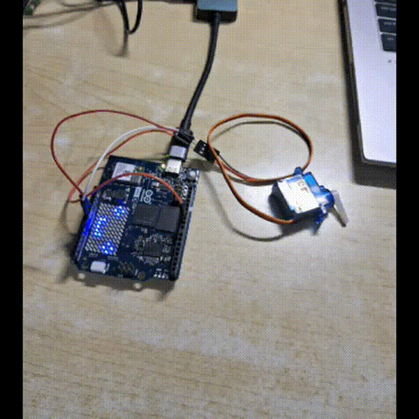
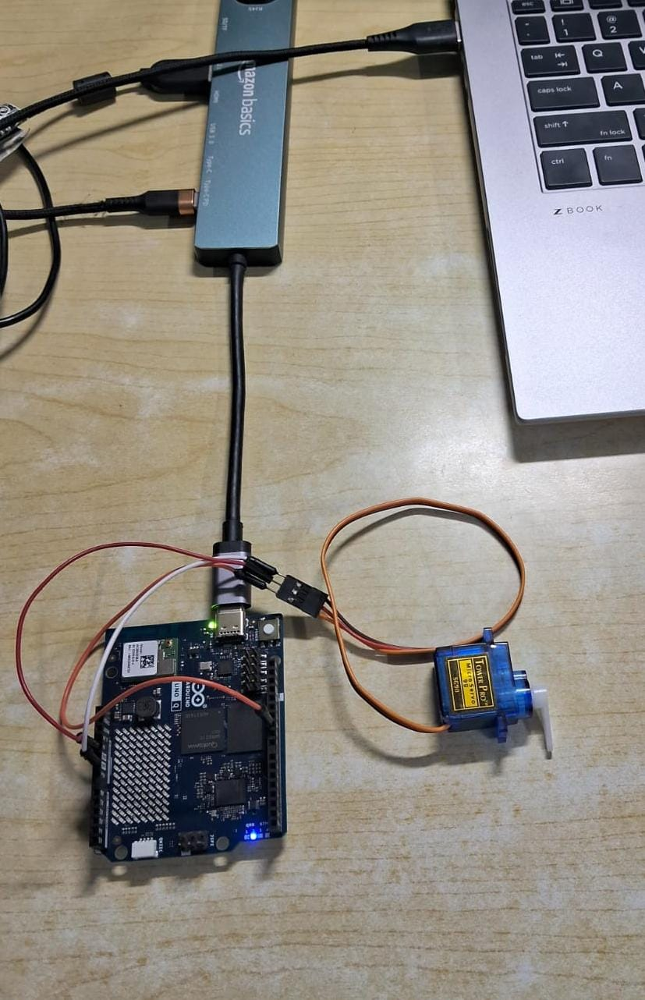

# Person-Aware Interactive System on Arduino UNO Q

Real-time vision project using the **Arduino UNO Q** that detects a person and triggers interactive responses through a **servo motor** and the **onboard LED matrix**.

---

## 📌 Overview

This project demonstrates how to build an interactive embedded system using the dual-processor architecture (MPU+MCU) of the Arduino UNO Q.

A vision model running on the Linux side detects the presence of a person and communicates with the microcontroller via the Router Bridge. The MCU then performs physical actions such as waving a servo and displaying expressions on the LED matrix.

---

## ✨ Features

* Real-time person detection
* Servo wave gesture when a person is detected
* LED matrix expressions (happy / neutral)
* State-machine based non-blocking firmware
* Communication via Arduino Router Bridge
* Edge AI running locally on the UNO Q

---

## 🏗️ System Architecture

Linux Side (MPU)

* Runs vision inference
* Handles detection logic
* Sends commands via Bridge

MCU Side

* Receives commands
* Controls servo motion
* Updates LED matrix

---

## 🛠️ Hardware Requirements

* Arduino UNO Q
* Servo motor
* Jumper wires
* Power supply
* USB Webcam
* USB C Hub

---

## 💻 Software Components

* Arduino App Framework
* VideoImageClassification brick
* Arduino Router Bridge
* Python detection logic

---

## ❓ How It Works
* **Vision Processing:** Camera feed is processed by the vision model.
* **Detection:** When a person is detected, a command is sent to the MCU.
* **Action:** MCU enters a waving state.
* **Servo:** Performs a wave gesture.
* **LED Matrix:** Displays a happy expression.
* **Reset:** System returns to neutral when no person is present.

---

## 💻 Setup & How to Use 

### 1️⃣ Clone the Repository to Your Laptop
git clone https://github.com/Amartya106/uno-q-vision-servo.git
cd uno-q-vision-servo

### 2️⃣ Transfer Files to the UNO Q
You can copy the project to the board using scp (replace the IP address):
scp -r . arduino@<UNO_Q_IP>:~/ArduinoApps/visionservo
*Or use the Arduino Apps interface to upload the app.*

### 3️⃣ Run the app
Run the app using the Arduino App Lab

### 4️⃣ Test the Interaction
Stand in front of the camera — the servo should wave and the LED matrix should change expression.

---

## 🧠 Key Concepts Demonstrated

* Edge AI on embedded Linux
* Inter-processor communication
* Non-blocking embedded design
* State machine control
* Human-robot interaction

---

## 📸 Demo

A quick preview of the system detecting a person and responding.

**Full video:** [Watch here](assets/updated_demo.mp4)

---

## ⚙️ Challenges Faced 

- **Bridge Timeouts**  
  Running servo logic inside Bridge handlers caused request timeouts. This was fixed by implementing a non-blocking state machine.

- **Pipeline Lifecycle Management**  
  Restarting the vision application left inference processes running, requiring cleanup between runs.

- **Callback Stability**  
  Detection callbacks occasionally stalled, leading to a redesign using a centralized detection handler.

- **Coordination Between Processors**  
  Managing synchronization between Linux-side inference and MCU-side control required careful state management.

---

## 🔮 Future Improvements

* Person tracking instead of detection
* Smooth servo easing motion
* Additional expressions on LED matrix
* Audio feedback

